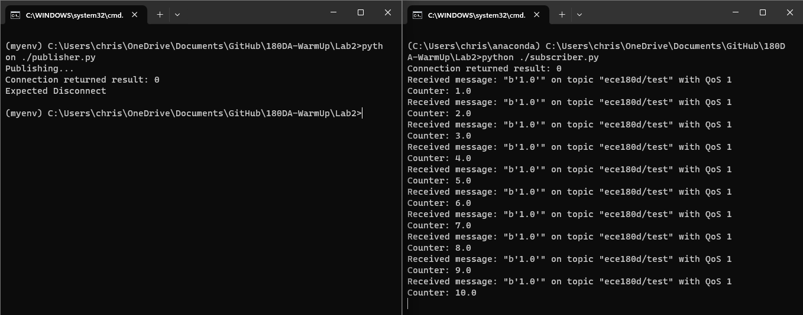

QUESTIONS:

Based on your experiences, what is made possible using MQTT? 

What seems fairly difficult using MQTT? If you were to use MQTT, what would be areasonable communications lag time be? Would you prefer to use a different method of transmitting data?