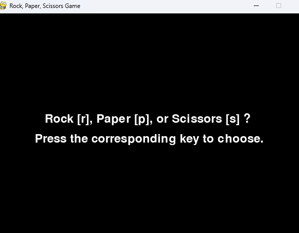
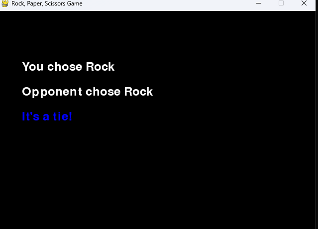

Command Line Games (Multiplayer and AI):

PY Game Screenshots

Most of our graphics will likely be through a software like unity since we are planning to do an interactive 3-Dimesnional Golfing game. Although the PyGame has many capabilities in terms of adding images and sprites, it will not be enough for our specific concept.
