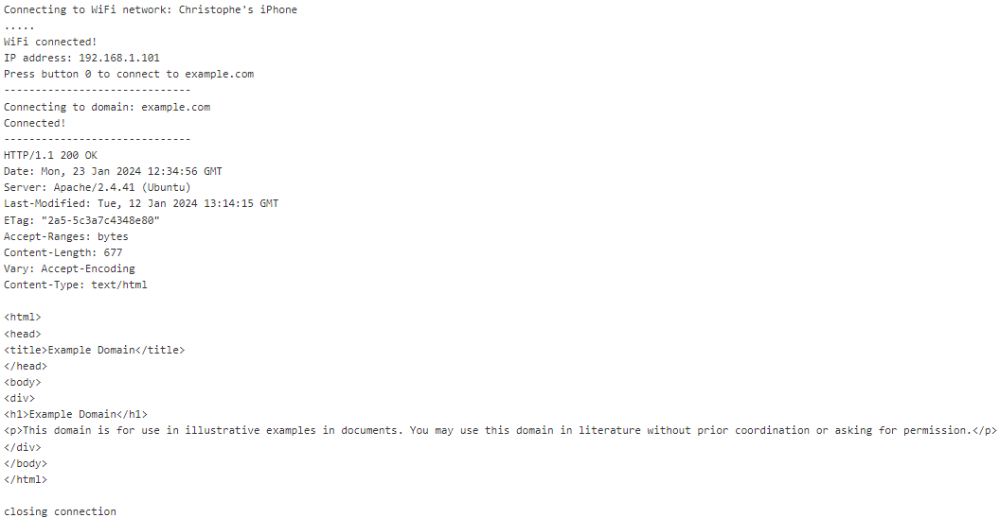

# Task 1

# Task 2

# Task 3

I did notice lag when it came to dealing with the IMU. I think that reducing the frequency of the messages (i.e increasing the delay of the arduino loop) can help with reducing this lag. I think that the biggest thing isnot to further increase the lag than it already is from the MQTT communication.

# Task 4
