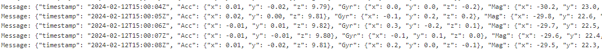

# Task 1

# Task 2

# Task 3

I did notice lag when it came to dealing with the IMU. I think that reducing the frequency of the messages (i.e increasing the delay of the arduino loop) can help with reducing this lag. I think that the biggest thing isnot to further increase the lag than it already is from the MQTT communication.

# Task 4
Upon running the IMU code and visually exploring the data stream, the direction of the +x, +y, and +z axes can be roughly determined, along with confirming the roll, pitch, and yaw values. The presence of gravity acceleration when idle can indeed be observed, typically in the negative z direction.

Characterizing the idle IMU position involves rotating the IMU in different directions to observe any drift in values when idle. While some slight drift may occur, a good feature to classify idle vs. non-idle is the variance in accelerometer readings over a short time period. Recording this classification and creating a confusion matrix can help assess the accuracy of the classification.
